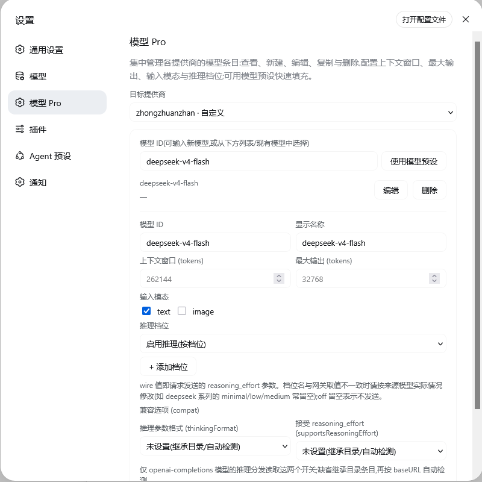
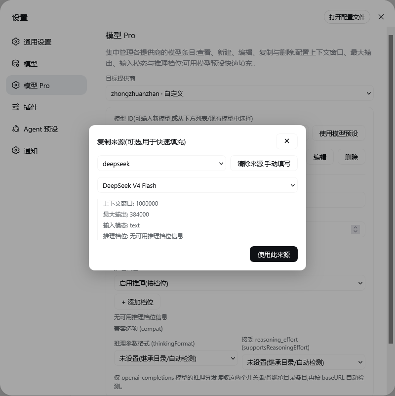

# dsh-provider-model-configurator

一个 [DeepSeek Harness (DSH)](https://github.com/deepseek-ai/dsh) **插件**:在独立设置页「模型 Pro / Model Pro」中集中**查看、新建、编辑、复制与删除**已配置提供商下的模型条目——上下文窗口、最大输出、输入模态、推理档位与推理兼容开关。还可以从内置的 `llm-pi-ai` 模型列表读取您所需要配置的模型的上下文参数、最大Token，无需自行填写、手动查询。

## 界面预览

| 模型 Pro 设置页 | 复制来源选择器 |
| --- | --- |
|  |  |

## 安装

```sh
# 从 GitHub 安装
dsh plugin --profile web add github:LiangYin233/dsh-provider-model-configurator#v0.3.4

# 或从 GitHub tarball 安装
dsh plugin --profile web add https://github.com/LiangYin233/dsh-provider-model-configurator/archive/refs/tags/v0.3.4.tar.gz

# 或从本地打包安装
npm pack
dsh plugin --profile web add ./dsh-provider-model-configurator-0.3.4.tgz
```

安装后**重启 Web 服务器并刷新页面**,打开设置 → 左侧导航「模型 Pro」(Models 页之后)。

## 功能

- 选择**目标提供商**,列出其显式模型条目与配置摘要,可**编辑 / 删除**;
- **新建**:输入模型 ID,手动填写显示名、上下文窗口、最大输出、输入模态(text/image)、推理档位(档位 → wire 值,`off` 留空 = 不发送);
- **复制填充**:「使用模型预设」打开来源选择器,从预设目录或其他提供商挑一个模型快速填充表单;
- **兼容开关 (compat)**:编辑 `thinkingFormat`(openai / deepseek / openrouter / together / zai / qwen / string-thinking / ant-ling)与 `supportsReasoningEffort`(true / false / 未设置),供 openai-completions 推理分发读取;

## 仓库结构

```
├── package.json        bundle 清单(dsh.bundle.patch / dsh.client / exports)
├── cordis.patch.yml    bundle patch:挂载 dsh-provider-model-configurator
├── dsh.plugin.json     插件元数据(id / version / main)
├── docs/               界面截图(README 预览用)
├── lib/                构建产物(随包发布,由 build.mjs 生成)
│   ├── index.js        ← src/host/index.js
│   ├── contract.js     ← src/host/contract.js
│   └── client.js       ← src/client/static.tsx
├── src/
│   ├── host/           Host 半区源码(index.js 静态 / dynamic.js 动态插件)
│   └── client/         Client 半区源码(page.tsx / model.ts / page.css / locales/)
├── build.mjs           esbuild 构建(lib/ 与 dist/dynamic-client-body.js)
└── tsconfig.json
```

## License

MIT

## 鸣谢

[LINUX DO](https://linux.do/)
